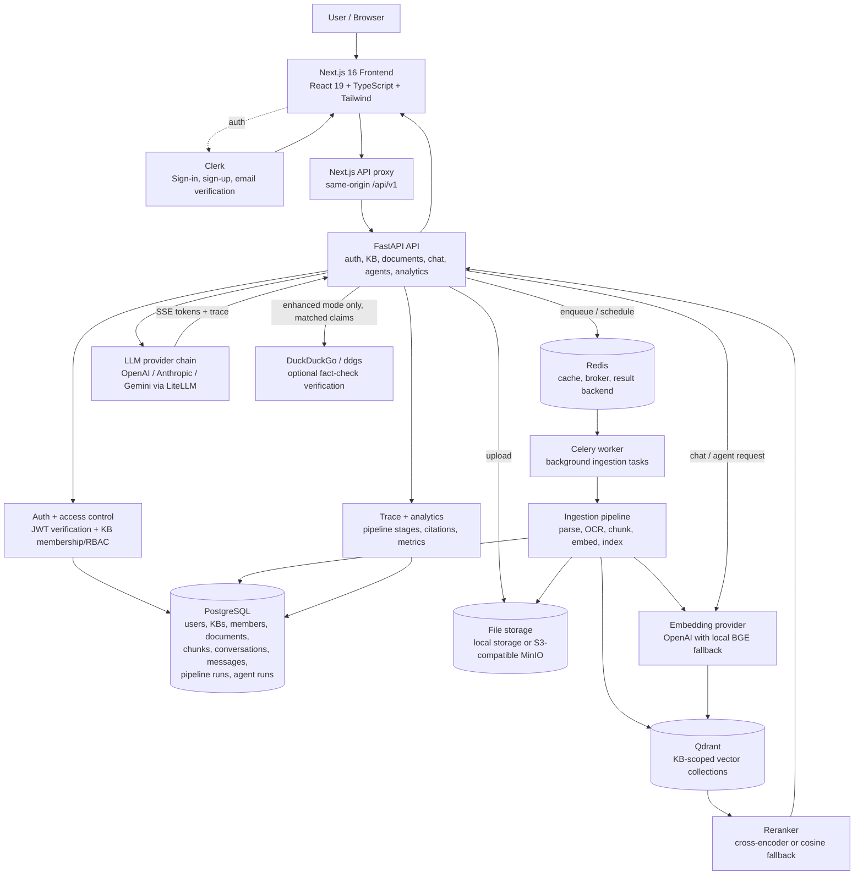
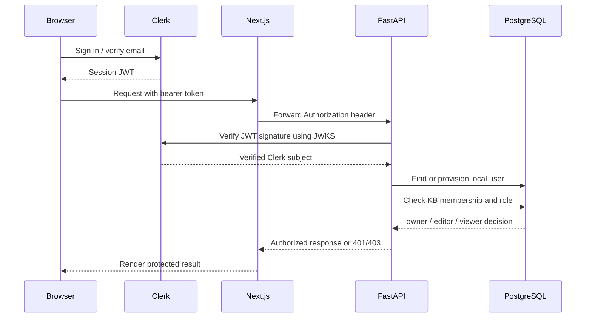
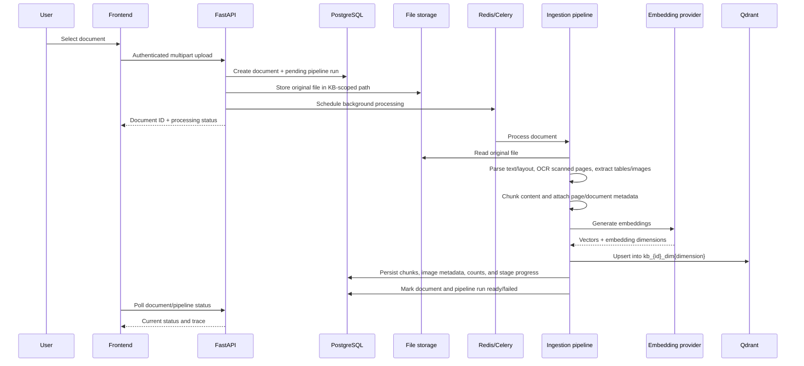
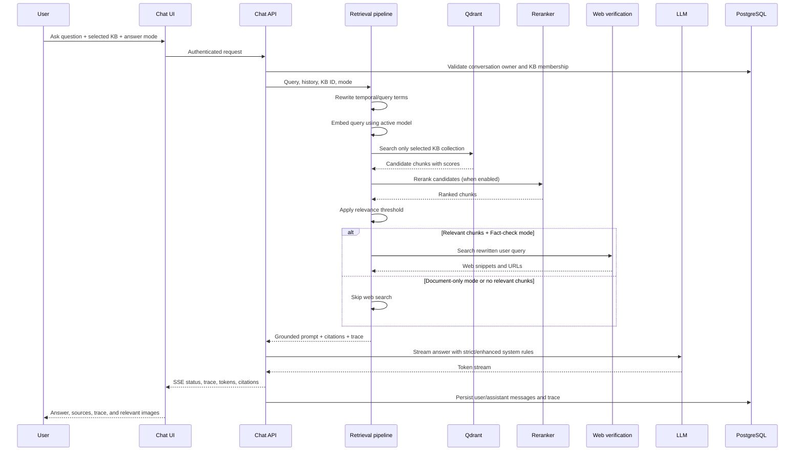
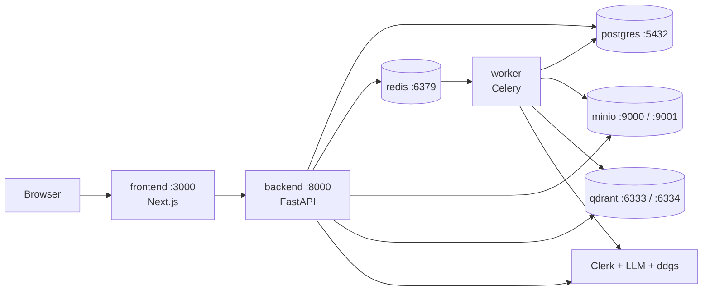

# RAGLens Architecture

RAGLens is a multi-tenant, Clerk-authenticated retrieval-augmented generation (RAG) workspace. Users create or join knowledge bases, upload source documents, ask grounded questions, inspect retrieval traces, and run document-backed agent workflows.

The central design rule is **workspace-scoped grounding**: a request can retrieve only from the selected knowledge base, and every protected operation is checked against the authenticated user and that knowledge base's membership.

## System architecture

## Runtime components

### Frontend

The `frontend/` application is a Next.js App Router application:

- `src/app/page.tsx`: public landing page and product entry point.
- `src/app/login` and `src/app/register`: Clerk authentication screens.
- `src/app/dashboard/layout.tsx`: authenticated dashboard shell, responsive navigation, and workspace context.
- `src/app/dashboard/knowledge`: knowledge-base creation, selection, and membership-aware workspace management.
- `src/app/dashboard/documents`: upload, status, document listing, deletion, and source image access.
- `src/app/dashboard/page.tsx`: grounded chat, answer-mode selection, citations, trace inspector, and inline document images.
- `src/app/dashboard/agents`: LangGraph-backed workflow runner and run history.
- `src/app/dashboard/playground`: prompt-template execution against an explicitly selected knowledge base.
- `src/app/dashboard/prompts`: reusable prompt templates with private/public workspace visibility.
- `src/app/dashboard/analytics` and `src/app/dashboard/pipelines`: backend-backed observability views.
- `src/components/common/brand-logo.tsx`: shared uploaded RAGLens logo and mark.
- `src/lib/api-client.ts`: authenticated API client and backend request helpers.

The frontend sends Clerk bearer tokens to FastAPI. In local development, Next.js rewrites or proxies API requests through `/api/v1`; `BACKEND_ORIGIN` controls the backend destination.

### Backend API

The `backend/app/` FastAPI application is divided into API, application, core, and infrastructure layers:

| Area | Responsibility |
| --- | --- |
| `api/v1/routers/auth.py` | Resolve the current user and local authentication endpoints. |
| `api/v1/routers/knowledge_bases.py` | Create, list, update, and delete knowledge bases. |
| `api/v1/routers/members.py` | Add, list, update, and remove knowledge-base members and roles. |
| `api/v1/routers/documents.py` | Upload, list, inspect, delete, and serve document-related resources. |
| `api/v1/routers/chat.py` | Create conversations, retrieve context, stream LLM output, and persist messages. |
| `api/v1/routers/agents.py` | Start and inspect owner-scoped LangGraph agent runs. |
| `api/v1/routers/playground.py` | Execute prompt templates against an authorized knowledge base. |
| `api/v1/routers/prompts.py` | CRUD for private and workspace-shared prompt templates. |
| `api/v1/routers/analytics.py` | Return workspace-scoped aggregate metrics. |
| `api/v1/routers/health.py` | Public service health check. |
| `application/ingestion/` | Document extraction, OCR, chunking, embeddings, and indexing. |
| `application/retrieval/pipeline.py` | Query embedding, vector retrieval, reranking, prompt construction, and image/source selection. |
| `application/agents/` | Agent graph orchestration and quiz generation/retrieval. |
| `core/clerk.py` and `api/v1/deps.py` | JWT verification, user provisioning, and access dependencies. |
| `infrastructure/db/` | Async SQLAlchemy engine, models, and persistence. |
| `infrastructure/vector_stores/` | Qdrant primary store and Chroma compatibility/fallback implementation. |
| `infrastructure/llm/` | Provider selection and LLM fallback chain. |

## Authentication and authorization

Knowledge-base roles are intentionally scoped at the KB level:

- **Owner**: full control, including deleting the KB and managing members.
- **Editor**: can query and modify documents, but cannot delete the KB or manage members.
- **Viewer**: can browse and query, but cannot modify documents or settings.

Every protected route must resolve the authenticated user and validate access to the requested KB. Agent runs also store an owner and KB reference, so a user cannot read or continue another user's run by guessing a thread ID. Workspace-less retrieval uses an intentionally empty collection name rather than a global shared collection.

## Document upload and ingestion

Ingestion records the original file separately from derived data. Each chunk keeps document ID, page number, content type, embedding metadata, and optional image paths. PDF handling can use layout-aware parsing and OCR fallback for scanned pages. Extracted images are stored beneath the document's storage area and linked through chunk metadata; the retrieval pipeline ranks assets using relevant page/content terms so a logo is not returned merely because it appears in the PDF.

The vector collection is knowledge-base and dimension scoped. The dimension guard prevents mixing embeddings from incompatible models in the same collection and asks for re-indexing when a mismatch is detected.

## Chat and retrieval architecture

### Answer modes

The chat request supports two modes:

1. **Document only (`strict`)**
   - Uses only relevant chunks from the selected workspace.
   - Never calls web search.
   - Refuses to guess when no matching document evidence exists.

2. **Fact-check and correct (`enhanced`)**
   - First performs the same workspace retrieval and relevance filtering.
   - Calls `ddgs` only when relevant document evidence exists.
   - Gives the document claim priority, compares it with returned web evidence, and adds a fact-check alert only when the web evidence actually contradicts the claim.
   - Includes clickable web sources in the retrieval trace.
   - If web verification fails or is inconclusive, reports that the claim could not be verified rather than inventing a correction.

No-match requests are deliberately short-circuited: they do not trigger web search and do not receive a general-knowledge answer. This prevents an unrelated web result from being presented as a correction to a document that was never retrieved.

### Streaming response

Chat uses Server-Sent Events (SSE) from `api/v1/routers/chat.py`:

1. A status event tells the UI whether it is searching documents or verifying claims.
2. A trace event contains retrieved/reranked chunks, citations, stages, answer mode, and optional web sources.
3. Token events stream the LLM response progressively.
4. A completion event persists latency/token metadata and closes the stream.

The trace inspector is backed by persisted `pipeline_trace`, `citations`, and `retrieved_chunks` fields on messages, which makes the answer explainable after the original request completes.

## Images and multimodal source handling

Image requests are detected from the current question and recent user turns. When relevant chunks are found, the pipeline:

1. Resolves the source document and retrieved pages.
2. Lists extracted document assets from the document-scoped image directory.
3. Ranks assets using the question, previous user context, page numbers, and page text.
4. Sends safe image metadata with the citations.
5. Lets the authenticated frontend fetch and render the actual image below the answer.

The LLM is instructed not to claim that it cannot provide an image when a source asset is available. The UI displays the original extracted image/diagram rather than a generated replacement or a text-only description.

## Agents, quiz, and playground

- **Agents** use LangGraph-style orchestration with explicit KB and run ownership. Retrieval nodes use the selected KB collection and never fall back to another workspace's vectors.
- **Quiz mode** retrieves KB content, generates multiple-choice questions, keeps options visible for selection, and reveals the answer only after submission.
- **Prompt playground** executes saved templates with extracted `{{variables}}`, requiring an authorized KB when the template is KB-scoped.
- **Prompt sharing** is read-only for other members when `is_public` is enabled; ownership controls update/delete operations.

## Persistence model

The main PostgreSQL entities are:

| Entity | Purpose |
| --- | --- |
| `users` | Local projection of authenticated users. |
| `knowledge_bases` | Workspace metadata, settings, counts, and embedding dimensions. |
| `knowledge_base_members` | User-to-workspace membership and owner/editor/viewer role. |
| `documents` | Original file metadata, processing state, and extracted statistics. |
| `chunks` | Text/table/code/audio chunks with page, position, and embedding metadata. |
| `pipeline_runs` | Ingestion stage status, progress, duration, and errors. |
| `conversations` | User-owned chat sessions associated with a KB. |
| `messages` | User/assistant content, citations, traces, token usage, and feedback. |
| `prompt_templates` | Reusable private or workspace-shared prompts. |
| `agent_runs` | Owner- and KB-scoped workflow thread ownership. |

Qdrant stores the searchable vector representation; PostgreSQL remains the source of truth for ownership, metadata, document state, and explainability records.

## Deployment topology

The supplied `docker-compose.yml` defines the local service topology:

For a lightweight local run, FastAPI can execute ingestion through its background task path, while the Docker topology provides Redis/Celery for worker-based processing. The configured vector provider is Qdrant; Chroma remains available as a compatibility/fallback implementation and for migration tooling.

## Security boundaries

- Clerk JWTs are verified through Clerk JWKS in non-development environments.
- Protected API routes require an authenticated user; health is the intentional public exception.
- Knowledge-base, conversation, document, prompt, playground, analytics, and agent operations are scope-checked.
- Vector collection names include the knowledge-base ID and embedding dimension.
- File serving validates ownership/membership and uses document-scoped paths.
- Storage path resolution prevents traversal outside the configured storage root.
- Agent run IDs are not treated as authorization; ownership and KB membership are checked from the database.
- Production/staging configuration rejects insecure default secrets.
- API keys remain server-side in environment configuration and are never sent to the browser.

## Observability and failure handling

Each ingestion and retrieval request records stages, durations, counts, errors, and source metadata. The backend logs request IDs and pipeline failures, while the UI exposes trace data through the answer inspector and pipeline/analytics views.

The system degrades explicitly:

- If a vector search fails, the answer is not silently sourced from another workspace.
- If embeddings use a different dimension from the indexed KB, retrieval asks for re-indexing.
- If the reranker is unavailable, cosine-score ordering can be used when configured.
- If web verification is unavailable, enhanced mode reports unavailable/inconclusive verification.
- If no relevant document evidence exists, the assistant asks for the correct workspace or upload instead of guessing.
