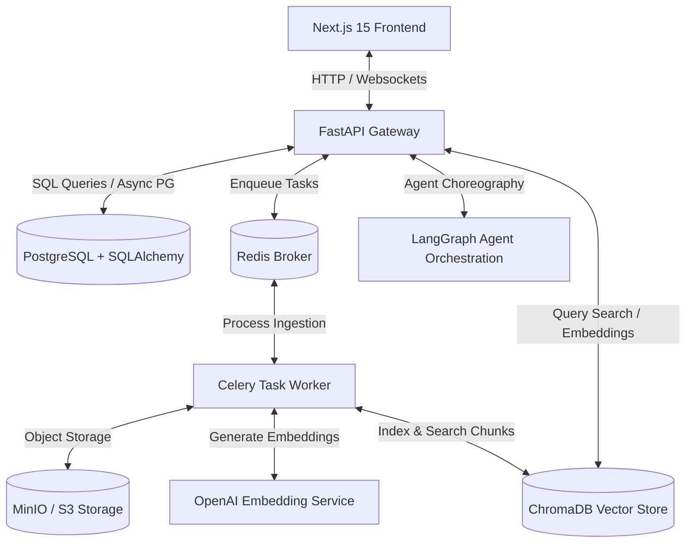

# RAGLense — System Architecture & Feature Explanation

RAGLense is an enterprise-grade, multimodal Retrieval-Augmented Generation (RAG) platform designed to demystify, visualize, and benchmark the entire lifecycle of a RAG pipeline. It bridges the gap between black-box AI processing and production-ready observability.

---

## 🏗️ 1. Architecture Overview

The system uses a modern **decoupled client-server architecture**, containerized for development and production workloads. 



- **Frontend**: Next.js 15 App Router providing dashboard, visual pipeline tracking, real-time metrics, prompt sandbox, and a model arena.
- **Backend API**: FastAPI serving as the API Gateway with asynchronous endpoints, Alembic DB migrations, and Clerk/custom token authentication.
- **Task Worker**: Celery executing CPU-bound text extraction, chunking, embedding, and vector database uploads.
- **Databases**:
  - **PostgreSQL**: Stores persistent relational data (users, files, knowledge bases, pipeline execution logs, chat histories).
  - **ChromaDB**: In-memory/persistent vector database storing chunk embeddings and conducting high-speed cosine/Euclidean similarity searches.
  - **Redis**: Serves as the message broker for Celery queues and acts as a high-speed runtime cache.

---

## 🛠️ 2. Core Modules & Features

### 🚀 A. The Visual Ingestion Pipeline
When a user uploads a document, the system triggers a background task managed by Celery.
1. **Validation Stage**: Validates file attributes (size, mime type) and deduplicates against historical files.
2. **Text Extraction Stage**: Handles multiple file types. Uses `PyMuPDF` (Fitz) and `pdfplumber` fallbacks for PDFs, `python-docx` for Word documents, and text decoders with fallback encoding (UTF-8, Latin-1) for CSV, markdown, and text files.
3. **Chunking Stage**: Leverages LangChain's `RecursiveCharacterTextSplitter` to break text into manageable chunks based on character/token limit constraints.
4. **Embedding Stage**: Connects to OpenAI (`text-embedding-3-small` or custom model settings) to generate high-dimensional vectors.
5. **Vector Store Storage**: Concurrent writing of the text chunk references in PostgreSQL and the embeddings in ChromaDB.

*The state of this pipeline is continuously logged in PostgreSQL and visually tracked using **React Flow** on the frontend, showing exactly which step is processing, completed, or failed.*

---

### 🔍 B. The Retrieval & Reranking Engine
When a user sends a query:
1. **Query Rewriting (Optional)**: A dedicated Agent uses a lightweight LLM task to rewrite the query to optimize keyword matching and intent.
2. **Dense Vector Search**: The rewritten query is vectorized using the same embedding provider and searched in ChromaDB.
3. **Reranking**: Scores are sorted and filtered based on threshold configurations to select the top-k chunks.
4. **Context Synthesis & Rerank Ranks**: Chunks are assembled into a structured prompt context with explicit source annotations (file name, chunk index, page number).

---

### 🤖 C. Multi-Agent Orchestration (LangGraph)
Beyond standard RAG, the project features a cooperative agentic design using **LangGraph** models:
* **RewriteAgent**: Resolves ambiguity in user queries.
* **RetrieverAgent**: Fetches relevant source documents.
* **CriticAgent**: Verifies groundedness (detects hallucinations) and relevance of the context.
* **GeneratorAgent**: Performs output synthesis and appends references.

---

### 📊 D. Evaluation Suite & Model Arena
* **Model Arena**: Side-by-side comparison of generation prompts across multiple models (OpenAI, Anthropic, Gemini, DeepSeek, local Ollama).
* **Metrics & Evaluation**: Leverages metrics from frameworks like **RAGAS** and **DeepEval** to compute scorecards indicating faithfulness, context recall, and semantic precision.

---

## 📂 3. Directory Breakdown

```text
RAG_project/
├── backend/
│   ├── app/
│   │   ├── api/            # API endpoints, request schemas, routers
│   │   ├── core/           # Configuration settings, third-party authentication
│   │   ├── domain/         # Domain entities and core business logic repositories
│   │   ├── application/    # Orchestrators (agents/, ingestion/, retrieval/)
│   │   └── infrastructure/ # Database schemas, storage managers, embeddings adapters, vector stores
│   ├── main.py             # FastAPI entrypoint
│   └── tasks.py            # Celery task registration & worker loop setup
├── frontend/
│   ├── src/
│   │   ├── app/            # Next.js App Router folders (dashboard, login, registers)
│   │   ├── components/     # Reusable shadcn/ui tables, flow panels, graphs
│   │   ├── stores/         # Zustand global state managers
│   │   └── lib/            # Axios API config, general utilities
│   ├── package.json        # Next.js dependencies (React Flow, Tailwind, Framer Motion)
│   └── tsconfig.json       # TypeScript configuration
├── docker-compose.yml      # Orchestrates all platform services
└── README.md               # Main instructions
```

---

## ⚙️ 4. Local Deployment & Requirements

### Infrastructure Prerequisites
- **Docker & Docker Compose** (highly recommended for running PostgreSQL, Redis, MinIO, and ChromaDB out of the box).
- **Python 3.12+**
- **Node.js 18+**

### Steps
1. **Set up Environment**: Copy `.env.example` to `.env` in the root folder and fill in API keys (e.g., `OPENAI_API_KEY`).
2. **Start Services**:
   ```bash
   docker-compose up --build
   ```
3. **Access Services**:
   - Frontend UI: `http://localhost:3000`
   - Interactive Backend Swagger Documentation: `http://localhost:8000/docs`
