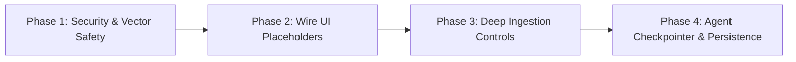

# RAGLens Deep-Dive Audit, Status & Master Roadmap Report

**Generated:** July 25, 2026  
**Target Repository:** `c:\Users\mihir\OneDrive\Desktop\RAG_project`  
**System Name:** RAGLens Enterprise Grounded Intelligence Platform  

---

## 1. Executive Summary & Codebase Health Overview

**RAGLens** is a multi-tenant, decoupled Enterprise Retrieval-Augmented Generation (RAG) platform. It provides hallucination-free document search, multi-agent evaluation workflows, layout-aware PDF/audio/code parsing, and fine-grained citations down to exact paragraph and timestamp bounds.

### Diagnostic Summary
- **Python Syntax & Compilation:** `0` errors (`python -m compileall backend/app` succeeded).
- **TypeScript Type Safety:** `0` errors (`tsc --noEmit` succeeded clean).
- **Architecture Grade:** Production-ready foundation with modular clean-architecture layers (API Routers -> Application Services -> Infrastructure Adapters).
- **Primary Tech Debt:** Unwired frontend mock UI pages, local vector store dimension mismatch risk on fallback, and absence of an automated pytest directory (`backend/tests`).

---

## 2. Exhaustive Component-by-Component Audit

### A. Backend Layer (`backend/app`)

#### 1. Authentication & Security
* **[deps.py](file:///c:/Users/mihir/OneDrive/Desktop/RAG_project/backend/app/api/v1/deps.py):** Fully wired. Validates both custom JWTs and Clerk JWKS public keys. Automatically provisions newly authenticated Clerk users into PostgreSQL on first login.
* **[security.py](file:///c:/Users/mihir/OneDrive/Desktop/RAG_project/backend/app/core/security.py):** Password hashing with bcrypt, JWT token generation, and signature verification.
* **[rbac.py](file:///c:/Users/mihir/OneDrive/Desktop/RAG_project/backend/app/infrastructure/db/models/rbac.py):** Role-Based Access Control schema implementing an explicit role hierarchy (`owner` > `editor` > `viewer`).

#### 2. Data Models (PostgreSQL + SQLAlchemy)
* **[knowledge.py](file:///c:/Users/mihir/OneDrive/Desktop/RAG_project/backend/app/infrastructure/db/models/knowledge.py):**
  * `KnowledgeBase`: Workspace isolation unit storing ownership, metadata, chunk count, token count, and storage size.
  * `Document`: File storage references, MIME types, processing statuses (`uploaded`, `processing`, `ready`, `error`), page counts, and pipeline execution logs.
  * `Chunk`: Text content, character/token bounds, vector IDs, parent-child hierarchical references, and keyword metadata.
  * `PipelineRun`: Detailed logs and progress tracking per ingestion run.
  * `Conversation` & `Message`: Chat history, LLM model settings, token/cost metrics, and full RAG similarity citation traces.

#### 3. Document Ingestion Engines
* **[pipeline.py](file:///c:/Users/mihir/OneDrive/Desktop/RAG_project/backend/app/application/ingestion/pipeline.py):** Standard 5-stage ingestion worker (Validation -> Extraction -> Chunking -> Embedding -> Vector & SQL Storage). Backed by Celery & Redis (`task_acks_late=True`).
* **[unstructured_parser.py](file:///c:/Users/mihir/OneDrive/Desktop/RAG_project/backend/app/infrastructure/ingestion/unstructured_parser.py):** Layout-aware PDF extraction converting titles, narrative text, and HTML/markdown tables using `unstructured[pdf]`.
* **[audio_ingestion.py](file:///c:/Users/mihir/OneDrive/Desktop/RAG_project/backend/app/infrastructure/ingestion/audio_ingestion.py):** Local transcription engine using `faster-whisper` (CPU/int8). Indexes timestamp ranges (`start_time_s`, `end_time_s`) into metadata for pinpoint audio/video citations.
* **[github_ingestion.py](file:///c:/Users/mihir/OneDrive/Desktop/RAG_project/backend/app/infrastructure/ingestion/github_ingestion.py):** Repository cloner and AST-aware code splitter for Python, JS, and TS using `tree-sitter`.

#### 4. Vector Stores & Embeddings
* **[chroma_store.py](file:///c:/Users/mihir/OneDrive/Desktop/RAG_project/backend/app/infrastructure/vector_stores/chroma_store.py):** Local ChromaDB persistent vector adapter using isolated collections (`kb_<uuid>`).
* **[qdrant_store.py](file:///c:/Users/mihir/OneDrive/Desktop/RAG_project/backend/app/infrastructure/vector_stores/qdrant_store.py):** Pluggable Qdrant vector database adapter supporting gRPC and HTTP cluster setups.
* **[fallback_embeddings.py](file:///c:/Users/mihir/OneDrive/Desktop/RAG_project/backend/app/infrastructure/embeddings/fallback_embeddings.py):** Primary OpenAI `text-embedding-3-small` (1536-dim) with local CPU fallback using `BAAI/bge-small-en-v1.5` (384-dim).

#### 5. Search, Reranking & Multi-Agent Intelligence
* **[reranking/__init__.py](file:///c:/Users/mihir/OneDrive/Desktop/RAG_project/backend/app/infrastructure/reranking/__init__.py):** Cross-encoder reranker wrapping `cross-encoder/ms-marco-MiniLM-L-6-v2` running in thread pools.
* **[semantic_cache.py](file:///c:/Users/mihir/OneDrive/Desktop/RAG_project/backend/app/infrastructure/cache/semantic_cache.py):** Semantic query caching in ChromaDB with configurable score thresholding (`threshold=0.95`).
* **[graph.py](file:///c:/Users/mihir/OneDrive/Desktop/RAG_project/backend/app/application/agents/graph.py):** LangGraph multi-agent flow coordinating four nodes:
  1. `RewriteAgent`: Keyword optimization.
  2. `RetrieverAgent`: Vector similarity search.
  3. `CriticAgent`: Factual grounding validation (blocks generation if relevance score < 0.3).
  4. `GeneratorAgent`: Answer generation.

---

### B. Frontend Layer (`frontend/src`)

#### 1. Fully Wired Dashboard Views
* **Grounded Chat & Trace Inspector ([app/dashboard/page.tsx](file:///c:/Users/mihir/OneDrive/Desktop/RAG_project/frontend/src/app/dashboard/page.tsx)):** Real-time SSE streaming chat with a collapsible right drawer showing precise chunk similarity scores, page numbers, and source snippets.
* **Knowledge Base Workspace ([app/dashboard/knowledge/page.tsx](file:///c:/Users/mihir/OneDrive/Desktop/RAG_project/frontend/src/app/dashboard/knowledge/page.tsx)):** CRUD operations for workspace units.
* **Document Uploader ([app/dashboard/documents/page.tsx](file:///c:/Users/mihir/OneDrive/Desktop/RAG_project/frontend/src/app/dashboard/documents/page.tsx)):** Drag-and-drop multi-file uploader with live Celery progress polling.
* **Analytics ([app/dashboard/analytics/page.tsx](file:///c:/Users/mihir/OneDrive/Desktop/RAG_project/frontend/src/app/dashboard/analytics/page.tsx)):** Live total storage size, token count, and document distribution metrics.
* **Agent Playground ([app/dashboard/agents/page.tsx](file:///c:/Users/mihir/OneDrive/Desktop/RAG_project/frontend/src/app/dashboard/agents/page.tsx)):** Visual execution trail of LangGraph step-by-step reasoning.

#### 2. Static UI Placeholders (Unwired Routes)
* **Model Evaluation (`/dashboard/evaluation`)**: Static UI placeholder with mock metrics.
* **Prompt Playground (`/dashboard/playground`)**: Static UI interface without backend execution endpoint.
* **A/B Testing (`/dashboard/experiments`)**: Visual placeholder UI.
* **Prompt Templates (`/dashboard/prompts`)**: Static template gallery.
* **System Settings (`/dashboard/settings`)**: UI layout without persistent user settings backend.
* **Custom Pipelines (`/dashboard/pipelines`)**: Visual flowchart editor without execution engine.

---

## 3. Comprehensive Feature Matrix

| Feature / Subsystem | Backend Status | Frontend Status | Overall Readiness | Notes |
| :--- | :--- | :--- | :--- | :--- |
| **Clerk & Bearer Auth** | 🟢 Complete | 🟢 Complete | 100% Ready | Auto-provisions PostgreSQL user |
| **Multi-Tenant Isolation** | 🟢 Complete | 🟢 Complete | 100% Ready | Scoped DB queries & collection names |
| **Background Ingestion** | 🟢 Complete | 🟢 Complete | 100% Ready | Celery + Redis background tasks |
| **PDF/DOCX/TXT Ingestion** | 🟢 Complete | 🟢 Complete | 100% Ready | Standard recursive character split |
| **Layout-Aware PDF Parser** | 🟢 Complete | 🟡 Partial | 85% Ready | `unstructured[pdf]` working in backend |
| **Audio/Video Transcriber** | 🟢 Complete | 🔴 Missing UI | 60% Ready | `faster-whisper` backend needs UI input |
| **GitHub Code AST Splitter** | 🟢 Complete | 🔴 Missing UI | 60% Ready | `tree-sitter` backend needs URL input |
| **Chroma & Qdrant Adapters** | 🟢 Complete | N/A | 100% Ready | Configurable vector store engine |
| **Cross-Encoder Reranker** | 🟢 Complete | 🟡 Partial | 75% Ready | Module built; disabled by default |
| **Semantic Caching** | 🟢 Complete | N/A | 90% Ready | Caches answers in ChromaDB |
| **SSE Grounded Chat** | 🟢 Complete | 🟢 Complete | 100% Ready | Streams tokens & retrieval traces |
| **LangGraph Multi-Agent** | 🟢 Complete | 🟢 Complete | 85% Ready | In-memory; lacks Redis checkpointer |
| **Analytics Workspace** | 🟢 Complete | 🟢 Complete | 100% Ready | Dynamic SQL aggregate queries |
| **Evaluations & Benchmark** | 🔴 Missing | 🟡 Placeholder | 20% Ready | Static UI mockup |
| **Prompt Playground** | 🔴 Missing | 🟡 Placeholder | 20% Ready | Static UI mockup |

---

## 4. Identified Bugs, Risks & Technical Debt

> [!WARNING]
> ### 1. Embedding Dimension Mismatch Hazard
> **Severity:** High  
> **Description:** OpenAI `text-embedding-3-small` generates 1536-dimensional vectors, while the fallback `BAAI/bge-small-en-v1.5` model generates 384-dimensional vectors. If OpenAI API fails and the fallback is triggered, querying or inserting into an existing collection built with 1536-dim vectors will cause vector database query crashes.  
> **Fix:** Store embedding model metadata on the collection level and mandate separate collection instances per vector dimension.

> [!IMPORTANT]
> ### 2. Cross-Encoder Reranker Bypass in Standard Chat Router
> **Severity:** Medium  
> **Description:** `CrossEncoderReranker` in [reranking/__init__.py](file:///c:/Users/mihir/OneDrive/Desktop/RAG_project/backend/app/infrastructure/reranking/__init__.py) is fully unit-functional. However, `app/api/v1/routers/chat.py` queries Chroma/Qdrant directly using cosine similarity without piping retrieved candidates through the cross-encoder reranking pass.  
> **Fix:** Inject `CrossEncoderReranker` into `chat.py` pipeline execution.

> [!NOTE]
> ### 3. Lack of Automated Pytest Test Suite
> **Severity:** Medium  
> **Description:** Running `python -m pytest backend/tests` fails because the `backend/tests` directory has not been populated.  
> **Fix:** Add unit and integration tests under `backend/tests/`.

---

## 5. Actionable Roadmap & Priority Action Plan

### Phase 1: Immediate Safety & Test Suite (Week 1)
1. **Create `backend/tests` Test Suite:** Implement pytest fixtures for DB session, Clerk token mocks, vector adapters, and chunking pipelines.
2. **Implement Vector Dimension Safety Guard:** Update `KnowledgeBase` DB model to store `embedding_model` and `vector_dimension`. Reject query execution if dimension mismatch occurs.
3. **Enable Reranker by Default:** Modify `chat.py` to route top-20 vector search results through `CrossEncoderReranker` to yield top-5 refined chunks.

### Phase 2: Wire Unwired Frontend Placeholders (Week 2)
1. **Prompt Playground Execution API:** Implement `POST /api/v1/playground/run` in backend to execute user prompts against configured models (OpenAI, Anthropic, Ollama).
2. **Prompt Template Persistence:** Add `PromptTemplate` database table and backend CRUD endpoints for `/dashboard/prompts`.

### Phase 3: Extend UI Controls for Advanced Parsers (Week 3)
1. **GitHub Ingestion Form:** Add repository URL input field to `/dashboard/documents` to trigger `ingest_github_repo`.
2. **Audio/Video Upload & Player:** Add support for `.mp3`, `.wav`, `.mp4` uploads and embed interactive audio playback with timestamp seek buttons matching transcription citations.

### Phase 4: LangGraph Checkpoint Persistence (Week 4)
1. **Redis Graph Checkpointer:** Integrate `langgraph.checkpoint.redis` or `PostgresSaver` in `graph.py` to allow multi-turn agent state resumption.

---

## 6. What Should NOT Be Done (Anti-Patterns & Directives)

- ❌ **DO NOT mix vector dimensions in the same database collection:** Never perform similarity search with 384-dim local vectors against a 1536-dim collection.
- ❌ **DO NOT execute synchronous AI model inference on FastAPI's main event loop thread:** Always wrap `faster-whisper`, `sentence-transformers`, or `unstructured` calls in `asyncio.to_thread` or Celery tasks.
- ❌ **DO NOT bypass the Critic Agent for customer-facing grounding checks:** Always maintain score validation thresholds (< 0.3 refusal trigger).
- ❌ **DO NOT replace SSE token streaming with blocking REST calls:** Streaming minimizes Time-To-First-Token (TTFT) latency for users.
- ❌ **DO NOT hardcode API credentials or local paths:** Always inject configuration via `app.core.config.get_settings()`.
