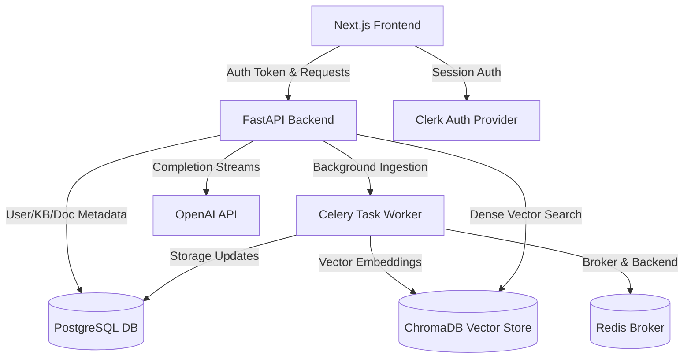

# RAGLens Engineering Status, Use Cases, & Limitations Report

This report provides a comprehensive, deep-dive analysis of the **RAGLens** codebase. It outlines the architectural design, fully wired and production-ready components, target business use cases, and system disadvantages (architectural trade-offs/limitations).

---

## 1. System Architecture & Component Mapping

RAGLens is built on a decoupled, asynchronous client-server architecture. The frontend handles auth, analytics representation, interactive chat, and ingestion tracking. The backend exposes REST and SSE (Server-Sent Events) streams, backed by PostgreSQL, Celery/Redis, and ChromaDB.



### A. Frontend Layer (Next.js 16 + React 19 + TypeScript + Tailwind)
Located in [frontend/src/](file:///c:/Users/mihir/OneDrive/Desktop/RAG_project/frontend/src):
* **User Authentication:** Integrated with Clerk ([clerk-api-bridge.tsx](file:///c:/Users/mihir/OneDrive/Desktop/RAG_project/frontend/src/components/auth/clerk-api-bridge.tsx)) to inject session tokens into HTTP headers.
* **Knowledge Base Workspace ([knowledge/page.tsx](file:///c:/Users/mihir/OneDrive/Desktop/RAG_project/frontend/src/app/dashboard/knowledge)):** Provides CRUD interfaces for isolated storage units (Knowledge Bases).
* **Document Uploader ([documents/page.tsx](file:///c:/Users/mihir/OneDrive/Desktop/RAG_project/frontend/src/app/dashboard/documents)):** Handles multi-file Drag-and-Drop, validating MIME types and sizes, and initiating the upload stream to FastAPI.
* **Grounded Chat & Trace Inspector ([page.tsx](file:///c:/Users/mihir/OneDrive/Desktop/RAG_project/frontend/src/app/dashboard/page.tsx)):** Contains the chat window (supporting SSE markdown streaming) and a collapsible sidebar displaying precise retrieval sources, matching chunks, and vector similarity scores.
* **Analytics ([analytics/page.tsx](file:///c:/Users/mihir/OneDrive/Desktop/RAG_project/frontend/src/app/dashboard/analytics)):** Displays workspace health metrics (documents uploaded, raw storage sizes, chunks generated) queried directly from the backend.
* **Multi-Agent Playground ([agents/page.tsx](file:///c:/Users/mihir/OneDrive/Desktop/RAG_project/frontend/src/app/dashboard/agents)):** A visual runner showing step-by-step reasoning logs (Rewrite, Retrieval, Critic, Generation) produced by LangGraph.

### B. Backend Layer (FastAPI + SQLAlchemy + Celery + ChromaDB)
Located in [backend/app/](file:///c:/Users/mihir/OneDrive/Desktop/RAG_project/backend/app):
* **Auth & User Provisioning ([clerk.py](file:///c:/Users/mihir/OneDrive/Desktop/RAG_project/backend/app/core/clerk.py)):** Verifies Clerk JWKS signatures. On first verification, it auto-registers the user in the PostgreSQL database.
* **Ingestion Orchestrator ([pipeline.py](file:///c:/Users/mihir/OneDrive/Desktop/RAG_project/backend/app/application/ingestion/pipeline.py)):** Executes a 5-stage pipeline:
  1. *Validation:* Validates file extensions and metadata.
  2. *Extraction:* Extracts text from raw bytes (PDF, DOCX, TXT, CSV, JSON, MD).
  3. *Chunking:* Recursively splits texts into uniform sizes using overlap criteria.
  4. *Embedding:* Calls OpenAI API (`text-embedding-3-small`) to convert text to vectors.
  5. *Storage:* Uploads chunks and metadata to ChromaDB and updates PostgreSQL tables.
* **Retrieval & RAG Pipeline ([pipeline.py](file:///c:/Users/mihir/OneDrive/Desktop/RAG_project/backend/app/application/retrieval/pipeline.py)):** Embeds queries, queries ChromaDB, formats context, and handles streaming OpenAI completions.
* **LangGraph Multi-Agent Workflows ([graph.py](file:///c:/Users/mihir/OneDrive/Desktop/RAG_project/backend/app/application/agents/graph.py)):** Features a coordinate agent pipeline:
  * `RewriteAgent`: Uses LLM to refine keywords.
  * `RetrieverAgent`: Performs similarity search.
  * `CriticAgent`: Validates factual grounding.
  * `GeneratorAgent`: Outputs response if critic approves; otherwise declines to prevent hallucination.

---

## 2. 100% Production-Ready & Wired Features

Unlike prototype systems that rely on fake data, these features are fully implemented, persistent, and functional:

1. **Secure JWT Auth & Session Sync:** Clerk bearer tokens are parsed and validated on every API call. Access to files and databases is secured using the logged-in user's identity.
2. **Multi-tenant Workspace Isolation:** Users can only view, query, or delete Knowledge Bases they own. Documents in one KB cannot leak into searches in another KB.
3. **Background Document Processing (Celery):** Uploads are processed asynchronously. If the backend worker crashes, tasks are safely re-queued in Redis (`task_acks_late=True`).
4. **Streaming SSE Grounded Chat:** Chat results are streamed token-by-token directly from OpenAI using Server-Sent Events, reducing time-to-first-token latency.
5. **Exact Retrieval Tracing & Citations:** Each chat message logs its retrieval parameters (similarity scores, file names, page numbers, text content) into the database, which the frontend displays in real-time.
6. **Live System Analytics:** Total databases metrics (tokens, chunk sizes, documents) are calculated dynamically using SQLAlchemy aggregates.
7. **Step-by-step Agent Logging:** The LangGraph playground queries the backend to run graph workflows in real-time, showing execution paths and validation status.

---

## 3. Core Database Schema Design (PostgreSQL)

Located in [knowledge.py](file:///c:/Users/mihir/OneDrive/Desktop/RAG_project/backend/app/infrastructure/db/models/knowledge.py):

* **`knowledge_bases`:** Tracks database workspace metadata, owning user ID, customized configuration JSON, document count, chunk count, token count, and total storage size.
* **`documents`:** Stores path references (`storage_path`), MIME types, file sizes, processing status (`uploaded`, `processing`, `ready`, `error`), page counts, and pipeline execution reports.
* **`chunks`:** Stores chunked texts, character/token counts, embedding dimensions, vector identifiers, parent-child references (for hierarchical chunking), and extracted keywords/entities.
* **`pipeline_runs`:** Logs execution details of file ingestion (timestamps, durations, logs per stage, progress indicators).
* **`conversations`:** Manages chat history logs, specific LLM settings (temperature, models), cost tracking, and titles.
* **`messages`:** Stores chat history, tokens used, latency in milliseconds, prompt/completion costs, and RAG pipeline traces (with exact similarity citations).

---

## 4. Real-World Business Use Cases

### Use Case A: Regulatory and Compliance Auditing (Legal/Finance)
* **Application:** Auditing contracts, compliance reports, or legal archives.
* **RAGLens Advantage:** Standard LLM chat can hallucinate rules. RAGLens enforces absolute transparency using the **Trace Inspector**. Auditors can click on any AI response and instantly trace it back to the exact document title, page number, and paragraph, proving the source of truth.

### Use Case B: Enterprise Knowledge Bases (Internal HR & Wiki Search)
* **Application:** Centralized search across employee handbooks, onboarding guides, and standard operating procedures (SOPs).
* **RAGLens Advantage:** Multi-tenant isolation ensures sensitive workspaces (e.g., HR files) are only visible to authorized employees. Background processing handles document updates without UI lag.

### Use Case C: Hallucination-Free Customer Service Agents
* **Application:** Deploying automated customer support chatbots that discuss product specifications.
* **RAGLens Advantage:** The Multi-Agent Critic prevents the model from generating random answers. If the vector retrieval scores are low (e.g., `< 0.3` similarity), the **Critic Agent** blocks the generation and outputs: *"I could not find sufficient grounded information to answer this question."*

---

## 5. System Disadvantages & Limitations (Tech Debt / Cons)

While RAGLens is built on a solid foundation, several engineering limitations must be addressed before deploying to high-scale production:

### A. Vector Database Scalability
* **Problem:** ChromaDB is configured using a local adapter. If the container or server restarts without persistent volume mapping, vector stores could be lost.
* **Impact:** High document volumes (millions of chunks) will cause RAM overhead issues on a single container.
* **Fix:** Transition from local ChromaDB to a hosted vector cluster (e.g., Pinecone, Milvus, Qdrant, or Postgres `pgvector`).

### B. Simple Scoring-based Retrieval & No Reranking Model
* **Problem:** Chunks are sorted using simple cosine similarity scores from the database ([pipeline.py](file:///c:/Users/mihir/OneDrive/Desktop/RAG_project/backend/app/application/retrieval/pipeline.py#L101)). There is no deep semantic cross-encoder reranker.
* **Impact:** Relevant chunks might get buried if they don't match semantic keywords exactly.
* **Fix:** Add a cross-encoder reranking stage (e.g., Cohere Rerank, BGE-Rerank) to compute deep contextual matching scores.

### C. Basic Chunking Strategy
* **Problem:** Files are split using basic recursive character chunking. It lacks specialized visual parsing.
* **Impact:** Tables, charts, figures, and structural components of PDFs are flattened into text blocks, destroying column relationships and rendering tabular data queries inaccurate.
* **Fix:** Implement multimodal chunking (e.g., Unstructured, LlamaParse) or layout-aware PDF parsers.

### D. Single LLM Lock-in (No Fallback)
* **Problem:** OpenAI is hardcoded as the sole provider for embeddings and text generation.
* **Impact:** If OpenAI experiences downtime, the system becomes completely non-functional.
* **Fix:** Add a fallback layer (e.g., LiteLLM, Anthropic, or local HuggingFace embedding models) to guarantee high availability.

### E. Stateful Agent Limitations
* **Problem:** The LangGraph multi-agent system runs statefully inside a single API call ([graph.py](file:///c:/Users/mihir/OneDrive/Desktop/RAG_project/backend/app/application/agents/graph.py#L194)).
* **Impact:** It does not persist intermediate states to a graph store. This prevents human-in-the-loop approvals or resuming long-running multi-agent workflows.
* **Fix:** Wire LangGraph to a Redis/PostgreSQL checkpointer to enable persistent agent sessions.

### F. No RBAC or Fine-Grained Permissions
* **Problem:** Workspace security relies on simple user ownership checks.
* **Impact:** You cannot share a Knowledge Base with a team or assign read-only/edit roles.
* **Fix:** Implement a detailed Role-Based Access Control (RBAC) schema.

---

## 6. Development Status & Unfinished Features

The following features in the Next.js UI are currently **honest placeholders** with no backend wiring:

| Page / Feature | Status | In Backend? | Path / Details |
| :--- | :--- | :--- | :--- |
| **Model Evaluations** | Placeholder | No | `frontend/src/app/dashboard/evaluation` |
| **Prompt Playground** | Placeholder | No | `frontend/src/app/dashboard/playground` |
| **A/B Testing Experiments** | Placeholder | No | `frontend/src/app/dashboard/experiments` |
| **Template Management** | Placeholder | No | `frontend/src/app/dashboard/prompts` |
| **System Settings** | Placeholder | No | `frontend/src/app/dashboard/settings` |

---

## 7. Verification & Run Commands

If you need to validate or run tests on the codebase, use these commands:

### Backend compilation check:
```bash
python -m compileall backend/app
```

### Frontend build validation:
```bash
cd frontend
npm run type-check
npm run build
```
