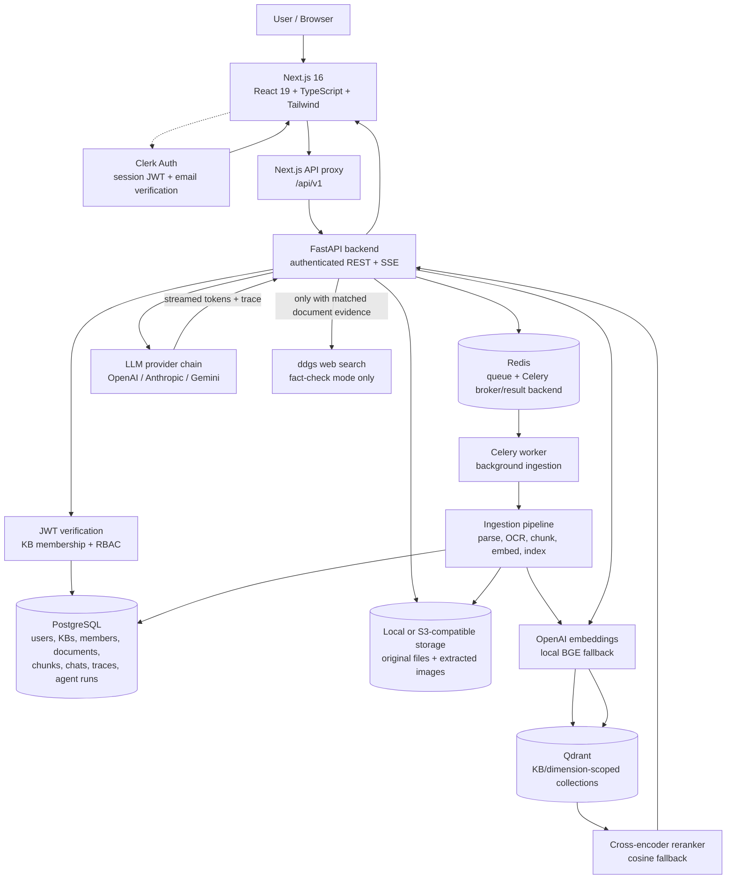

# RAGLens

RAGLens is a secure, multi-tenant document intelligence workspace. It lets authenticated users create knowledge bases, upload documents, ask grounded questions, retrieve relevant document images, run quizzes and agent workflows, and inspect how each answer was produced.

The product is built around one rule: **answers are scoped to the selected workspace and grounded in its documents**. External web search is optional and is used only by the fact-checking mode when relevant document evidence exists.

## Product capabilities

- Clerk sign-in, sign-up, email verification, and authenticated API access.
- Knowledge bases with owner, editor, and viewer roles.
- Workspace-scoped document upload, processing status, deletion, and source access.
- PDF/text extraction, layout-aware parsing, OCR fallback, chunking, embeddings, and vector indexing.
- Grounded chat with citations, retrieval traces, pipeline stages, and streamed answers.
- Two answer modes: `Document only` and `Fact-check & correct`.
- Relevant source image/diagram extraction and inline display in chat.
- Multiple-choice quiz flow with selectable options and answer reveal after submission.
- Prompt templates with variables and private/workspace-shared visibility.
- KB-scoped LangGraph agent runs, analytics, and ingestion pipeline visibility.
- Responsive dashboard with the RAGLens brand logo and mobile navigation drawer.

## Architecture



For the full component map, sequence diagrams, persistence model, deployment topology, and security boundaries, see [`ARCHITECTURE.md`](ARCHITECTURE.md).

### Architecture explained

The diagram follows the lifecycle of a request from the browser to the model and back:

1. **Frontend and authentication** — The Next.js dashboard is the user-facing layer. Clerk owns sign-in and session management. The browser sends the Clerk bearer token with API requests; the frontend never receives provider API keys.
2. **API and authorization** — FastAPI is the only application boundary for protected data. It verifies the JWT, resolves the local user, checks the selected knowledge-base membership, and applies the `owner`/`editor`/`viewer` role before performing the operation.
3. **Relational persistence** — PostgreSQL stores ownership and business state: users, knowledge bases, members, documents, chunks, conversations, messages, pipeline runs, prompt templates, and agent runs. It is the source of truth for access control and answer history.
4. **File storage** — Original uploads and extracted page images are stored separately from database metadata. Storage paths are document- and workspace-scoped so a source file cannot be fetched by knowing an unrelated URL or ID.
5. **Ingestion pipeline** — Upload processing parses text and layout, uses OCR for scanned pages when needed, extracts tables/images, creates metadata-rich chunks, generates embeddings, and writes vectors to the selected KB collection. Processing progress and failures are recorded in `pipeline_runs`.
6. **Vector retrieval** — Qdrant stores semantic vectors in collections named with the knowledge-base ID and embedding dimension. A query is embedded with the active embedding provider, candidates are retrieved, reranked, and filtered before they can enter the LLM prompt.
7. **Answer generation** — The retrieval pipeline builds a prompt containing only relevant chunks and source metadata. LiteLLM sends it to the configured provider fallback chain, and FastAPI streams status, trace, citations, and answer tokens to the UI through SSE.
8. **Optional verification** — In `Fact-check & correct` mode, `ddgs` is called only after relevant document evidence has been found. Web snippets are evidence for comparison, not a replacement for workspace retrieval. In `Document only` mode, the web is never called.

This separation keeps authentication, persistence, retrieval, generation, and external verification independently observable and prevents a no-match query from turning into an unrelated web answer.

### API surface

All routes below are under `/api/v1` and require authentication unless marked public.

| Route group | Main responsibilities |
| --- | --- |
| `/auth` | Current-user resolution and local auth support. |
| `/knowledge-bases` | Create, list, update, and delete workspaces. |
| `/knowledge-bases/{id}/members` | Invite/list/update/remove KB members and roles. |
| `/documents` | Upload files or GitHub content, inspect status, list/delete documents, and fetch protected source images. |
| `/chat` | Create conversations, list messages, and stream grounded answers over SSE. |
| `/playground` | Generate document-backed quizzes and run configurable prompts. |
| `/prompts` | Create, list, update, delete, and share reusable prompt templates. |
| `/agents` | Start, inspect, approve, reject, and continue KB-scoped agent runs. |
| `/analytics` | Return live workspace aggregate metrics. |
| `/health`, `/ready`, `/version` | Service health/readiness/version checks; intentionally public. |

## Main request flows

### Upload and ingestion

1. The browser sends an authenticated multipart upload for the selected knowledge base.
2. FastAPI validates the user, KB membership, file limits, and storage path.
3. The original file and a `documents` record are created.
4. Background processing extracts text, layout, tables, OCR content, and source images.
5. Content is chunked and enriched with document/page/content-type metadata.
6. The embedding provider creates vectors, which are stored in the KB's Qdrant collection.
7. `pipeline_runs`, document status, counts, and errors are persisted for the UI.

### Grounded chat

1. The user selects a workspace and sends a question.
2. FastAPI verifies conversation ownership and KB membership.
3. The retrieval pipeline rewrites the query, embeds it, and searches only the selected KB collection.
4. Candidate chunks are reranked and filtered by relevance thresholds.
5. The LLM receives the relevant document context, conversation history, and source metadata.
6. The answer is streamed over SSE together with citations and retrieval trace events.
7. The message, citations, trace, token usage, and latency are persisted in PostgreSQL.

### Answer modes

| Mode | Behavior | Web search |
| --- | --- | --- |
| **Document only** (`strict`) | Answers only from relevant selected-workspace chunks; does not guess when evidence is missing. | Never |
| **Fact-check & correct** (`enhanced`) | Retrieves document evidence first, then compares matched claims with web evidence and cites returned URLs when a contradiction is supported. | Only when relevant chunks exist |

If no relevant document is found, the request does not call the web and does not produce a general-knowledge answer or a false fact-check alert. If web verification is unavailable or inconclusive, the answer says it could not be verified instead of inventing a correction.

### Relevant document images

When the question asks for an image, diagram, chart, figure, or similar visual, RAGLens uses the retrieved document pages and content terms to rank extracted assets. The authenticated UI displays the actual source image below the answer; it does not substitute a logo, fabricated image, or text-only claim that images cannot be provided.

## Security model

- Clerk JWTs are verified through Clerk JWKS outside development mode.
- Protected API routes require authentication; the health endpoint is the intentional public exception.
- Every document, conversation, prompt, analytics, playground, and agent operation is scope-checked.
- KB roles are `owner`, `editor`, and `viewer`.
- Vector collections are named using the KB ID and embedding dimension, preventing cross-workspace retrieval and incompatible vector mixing.
- Agent runs store owner and KB references; a thread ID alone is never authorization.
- File access uses document-scoped paths and traversal-safe resolution.
- API keys stay in server-side environment variables and are not sent to the browser.
- Production/staging settings reject insecure default secrets.

## Repository layout

```text
RAG_project/
├── backend/
│   ├── app/api/v1/routers/       # authenticated FastAPI routes
│   ├── app/application/ingestion # extraction and indexing pipeline
│   ├── app/application/retrieval # grounded retrieval and prompt building
│   ├── app/application/agents/   # agent and quiz workflows
│   ├── app/core/                 # config, Clerk, and security helpers
│   ├── app/infrastructure/       # DB, vector stores, LLMs, storage
│   └── migrations/               # schema/migration utilities
├── frontend/
│   ├── src/app/                  # landing, auth, and dashboard routes
│   ├── src/components/           # shared UI, layout, and branding
│   └── src/lib/                  # API client and frontend utilities
├── docker/                       # backend/frontend Dockerfiles
├── docker-compose.yml            # Postgres, Redis, MinIO, Qdrant, app, worker
├── ARCHITECTURE.md               # detailed runtime and sequence diagrams
└── README.md
```

## Technology stack

| Layer | Technology |
| --- | --- |
| Frontend | Next.js 16, React 19, TypeScript, Tailwind CSS |
| Authentication | Clerk |
| API | FastAPI, Pydantic, async SQLAlchemy |
| Relational data | PostgreSQL |
| Vector search | Qdrant; Chroma compatibility/fallback tooling |
| Background processing | Celery + Redis; FastAPI background path for lightweight local runs |
| File storage | Local filesystem or S3-compatible MinIO |
| Embeddings | OpenAI with local `BAAI/bge-small-en-v1.5` fallback |
| Reranking | Cross-encoder with cosine-score fallback |
| LLMs | LiteLLM provider fallback chain |
| Web verification | `ddgs` through the LangChain community wrapper |

## Quick start

### Prerequisites

- Python 3.12+
- Node.js and npm
- PostgreSQL, Redis, and Qdrant for the full local stack, or Docker Desktop
- Clerk keys and at least one LLM provider key

### Environment

```bash
copy .env.example .env
```

Fill in the required Clerk and LLM provider values. Keep `.env` local and never commit secrets.

Important settings include:

- `BACKEND_ORIGIN`: backend destination used by the Next.js proxy.
- `NEXT_PUBLIC_API_URL`: leave empty to use same-origin `/api/v1` proxying in local development.
- `DATABASE_URL`: PostgreSQL connection string.
- `QDRANT_URL` and `VECTOR_DB_PROVIDER`: vector database configuration.
- `CLERK_JWKS_URL`: required for secure Clerk token verification outside local development.
- `OPENAI_API_KEY` or another configured LLM provider key.

### Run the backend

```bash
cd backend
python -m venv .venv
.venv\Scripts\activate
pip install -e .[dev]
uvicorn app.main:app --reload --port 8000
```

### Run the frontend

```bash
cd frontend
npm install
npm run dev
```

Open [http://localhost:3000](http://localhost:3000). In debug mode, the API documentation is available at [http://localhost:8000/docs](http://localhost:8000/docs).

### Run the full Docker stack

```bash
docker compose up --build
```

This starts PostgreSQL, Redis, MinIO, Qdrant, the FastAPI backend, a Celery worker, and the Next.js frontend.

## Validation

```bash
cd frontend
npm run type-check
npm run lint
npm run build
```

```bash
python -m compileall backend/app
```

## Implemented and remaining scope

### Implemented

- Workspace-scoped retrieval and document access checks.
- Owner/editor/viewer RBAC for knowledge bases.
- Secure agent-run ownership and KB validation.
- Document image extraction, relevance ranking, and authenticated inline rendering.
- Quiz options that require user selection before revealing the answer.
- Prompt template visibility rules for private and workspace-shared templates.
- Retrieval traces with document citations and optional web-source links.

### Intentionally not implemented yet

- Model comparison is still a placeholder; the playground can run one configured model at a time.
- Evaluation, experiments, and global runtime-settings screens remain honest placeholders because they do not yet persist complete backend state.
- Fact-checking verifies claims relevant to the current retrieved question; it is not a full page-by-page audit of an entire PDF. A whole-document audit would need a separate batch workflow.
- Email delivery for member invitations is not implied by a membership record; production invitations should add an email provider, expiry, acceptance, and audit trail.
- Production deployment still needs operational controls such as secret-manager integration, HTTPS, database migrations in CI/CD, backups, monitoring, and rate-limit enforcement at the edge.

## Product boundary

The core upload, ingestion, retrieval, chat, security, analytics, agent, quiz, and prompt-template flows are backend-backed. Any dashboard area that is not yet connected to persistence remains an explicit placeholder rather than showing fabricated demo metrics or model output.
